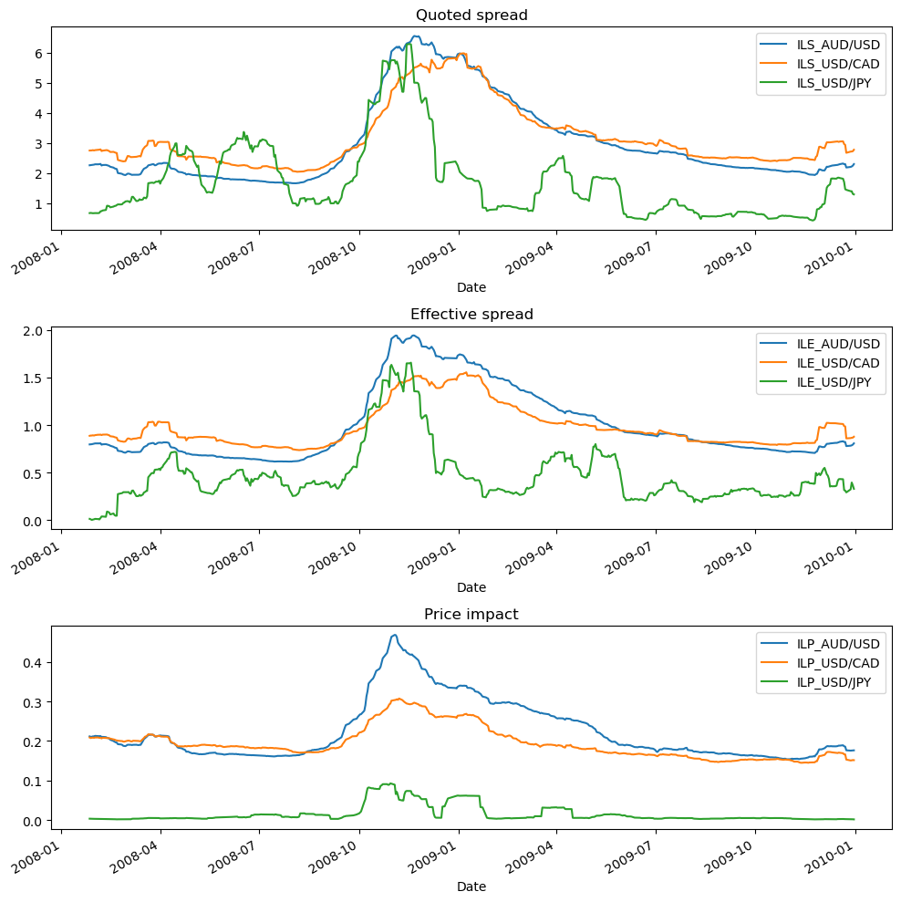
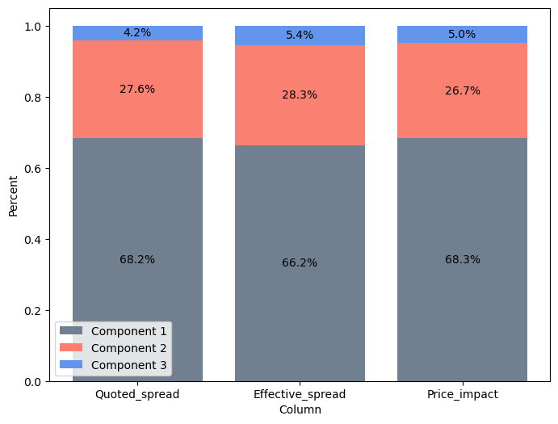
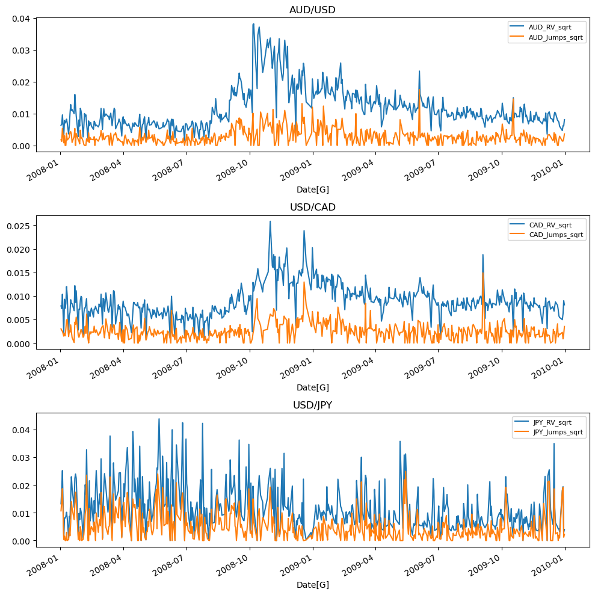

# 💱 High-Frequency FX Liquidity

**Full Title**: *Commonality and Risk Drivers of Liquidity in the FX Market: Evidence from High-Frequency Data During the Global Financial Crisis*

This repository contains the code and data for the assignment project in **Financial Markets 1 (IB9KA0)**, supervised by **Prof. Roman Kozhan**.

---

## 🔍 Overview

Foreign exchange (FX) market liquidity is a critical component of financial markets. In 2022, its daily turnover exceeded 8 trillion USD. The FX market plays a vital role in ensuring efficiency and arbitrage conditions in other asset classes. Compared to other markets, it is distinct due to its limited transparency, heterogeneity of participants, and market fragmentation. Moreover, exchange rates are closely tied to central bank policy, further amplifying the importance of liquidity research.

This project combines insights from the literature on FX and market microstructure with empirical analysis using high-frequency tick-by-tick FX data from Reuters (Jan 2008 – Dec 2009) for three currency pairs:

- AUD/USD  
- USD/CAD  
- USD/JPY

Liquidity is measured in three ways:
1. **Bid-ask spread**
2. **Effective spread**
3. **Price impact**

A principal component analysis (PCA) is performed to capture a market-wide liquidity factor, which is strongly correlated with the noise measure of Hu et al. (2013). Daily jumps are identified following the methodology of Andersen et al. (2007).

## 🧪 Hypotheses

This study evaluates the following hypotheses based on the theoretical framework of Brunnermeier and Pedersen (2009) and subsequent literature:

- **H1**: FX market liquidity decreases with funding liquidity.
- **H2**: The negative impact of funding constraints on liquidity amplifies during times of crisis.
- **H3**: There are comovements in market liquidity across exchange rates.
- **H4**: Liquidity commonality increases during distressed market conditions.
- **H5**: FX market liquidity decreases with jump risks.

## 📁 Repository Structure

- `data_analysis.ipynb`: Summary statistics, PCA, liquidity analysis, and funding constraints.
- `jump_risk.ipynb`: Jump detection, Ljung-Box test, and assessment of jumps' impact on liquidity.
- `data_cleaning.ipynb`: Preprocessing and cleaning of raw tick data.
- `FM1.pdf`:  The assignment document with detailed analysis based on the code
- `/pic/`: Contains main figure outputs for the paper/project.
- `/data/`: Includes the cleaned and processed datasets used in the analysis.

> ⚠️ Note: The raw tick-level data is large and not included in this repository. It is processed in `data_cleaning.ipynb`.

## 📊 Data Sources

- **Tick-by-tick FX data**: Reuters (2008–2009)
- **Noise measure** (illiquidity): [Jun Pan's website](https://en.saif.sjtu.edu.cn/junpan/)
- **Market stress variables**: VIX and TED spread from the [FRED Economic Database](https://fred.stlouisfed.org/)

## 🧼 Data Description

Each order in the tick dataset includes:
- Currency pair
- Order type (limit/market)
- Trade direction and price
- Best bid and ask quotes
- Timestamps with 1/100 second precision

## 📸 Example Figures

Here are some example figures that represent key results from the analysis:

### 1. **Liquidity Measures**
This figure shows  the daily illiquidity estimates for three currency pairs (AUD/USD,USD/CAD,USD/JPY) from January 2008 to December 2009. To avoid the massive jumps, I plot a rolling average of liquidity measure sampled from every 5 days. The unit of measure is basis points. The value for USD/JPY has been divided by 10 for better display. The upper graph shows the quoted spread $IL^{s}$, the middle graph shows the effective spread $IL^{e}$, and the lower graph shows the price impact $IL^{p}$. All measures in all three pairs exhibit the similar time trend. The increase in FX illiquidity during the first quarter of 2008 was primarily caused by the collapse of Bear Stearns in March of that year. During the second quarter of 2008, liquidity began to increase again as investors believed that the worst of the crisis was over and started investing in the FX market once more. Additionally, central banks worldwide implemented policies to protect the financial system, which helped to boost liquidity. However, the last quarter of 2008 saw a significant increase in market illiquidity due to the collapse of Lehman Brothers, which triggered widespread uncertainty and turmoil in the financial markets. This decline in market liquidity the effects of the bankruptcy on market sentiment. In 2009, the market liquidity increased steadily and slowly as central banks continued to implement measures to stabilize the financial system and restore confidence in the markets. While there is a strong correlation in the movement of liquidity across different foreign exchange rates, the level of liquidity varies across the cross-section of rates. 

### 2. **PCA Commonality**
This figure plots  the proportion of variance explained by each principal component for each daily standardized liquidity measure. The gray part of the bar denotes the goodness of fit using the first principal component,  the pink part of the bar denotes increase in  the goodness of fit by including the second principal component, and the blue part of the bar denotes increase in  the goodness of fit by adding the third principal component. The first component explains between 66\% and 68\% of the variation, and this is slightly lower than the results from \cite{mancini2013liquidity}, probably because they fit the PCA with more exchange rates. 

  

### 3. **Realized and Bipower Volatility**
 This figure shows time series of the realized volatility and jumps estimated in the paper for the period spanning January 2008 to December 2009, in standard deviation form. The topmost figure represents AUD/USD, followed by USD/CAD in the middle, and USD/JPY at the bottom.  These series exhibit a significant degree of autocorrelation, which is confirmed by the Ljung-Box statistics for up to tenth-order serial correlation reported in Table B2 in the paper. The autocorrelation for AUD/USD and USD/CAD is more prominent, and these series show a distinct pattern: higher during the financial crisis compared to the normal period. In contrast, USD/JPY does not show the same pattern, possibly due to data quality issues. 

---

## 📚 References

- Andersen, T. G., Bollerslev, T., & Dobrev, D. (2007). *No-arbitrage semi-martingale restrictions for continuous-time volatility models subject to leverage effects, jumps and iid noise: Theory and testable distributional implications*. Journal of Econometrics, 138(1), 125–180.

- Ait-Sahalia, Y., Mykland, P. A., & Zhang, L. (2005). *How often to sample a continuous-time process in the presence of market microstructure noise*. The Review of Financial Studies, 18(2), 351–416.

- Barndorff-Nielsen, O. E., & Shephard, N. (2004). *Power and bipower variation with stochastic volatility and jumps*. Journal of Financial Econometrics, 2(1), 1–37.

- Bansal, R., & Yaron, A. (2004). *Risks for the long run: A potential resolution of asset pricing puzzles*. The Journal of Finance, 59(4), 1481–1509.

- Brunnermeier, M. K., & Nagel, S., & Pedersen, L. H. (2008). *Carry trades and currency crashes*. NBER Macroeconomics Annual, 23(1), 313–348.

- Brunnermeier, M. K., & Pedersen, L. H. (2009). *Market liquidity and funding liquidity*. The Review of Financial Studies, 22(6), 2201–2238.

- Foucault, T., Kozhan, R., & Tham, W. W. (2017). *Toxic arbitrage*. The Review of Financial Studies, 30(4), 1053–1094.

- Hameed, A., Kang, W., & Viswanathan, S. (2010). *Stock market declines and liquidity*. The Journal of Finance, 65(1), 257–293.

- Hu, G. X., Pan, J., & Wang, J. (2013). *Noise as information for illiquidity*. The Journal of Finance, 68(6), 2341–2382.

- Karnaukh, N., Ranaldo, A., & Söderlind, P. (2015). *Understanding FX liquidity*. The Review of Financial Studies, 28(11), 3073–3108.

- Karolyi, G. A., Lee, K.-H., & Van Dijk, M. A. (2012). *Understanding commonality in liquidity around the world*. Journal of Financial Economics, 105(1), 82–112.

- Korajczyk, R. A., & Sadka, R. (2008). *Pricing the commonality across alternative measures of liquidity*. Journal of Financial Economics, 87(1), 45–72.

- Kyle, A. S. (1985). *Continuous auctions and insider trading*. Econometrica: Journal of the Econometric Society, 1315–1335.

- Mancini, L., Ranaldo, A., & Wrampelmeyer, J. (2013). *Liquidity in the foreign exchange market: Measurement, commonality, and risk premiums*. The Journal of Finance, 68(5), 1805–1841.

- Pasquariello, P. (2014). *Financial market dislocations*. The Review of Financial Studies, 27(6), 1868–1914.

- Stoll, H. R. (1978). *The supply of dealer services in securities markets*. The Journal of Finance, 33(4), 1133–1151.

- Tauchen, G., & Zhou, H. (2011). *Realized jumps on financial markets and predicting credit spreads*. Journal of Econometrics, 160(1), 102–118.

